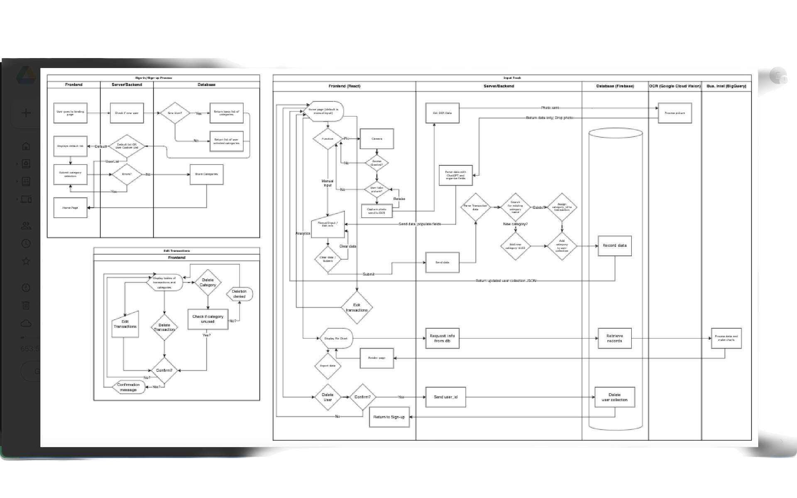
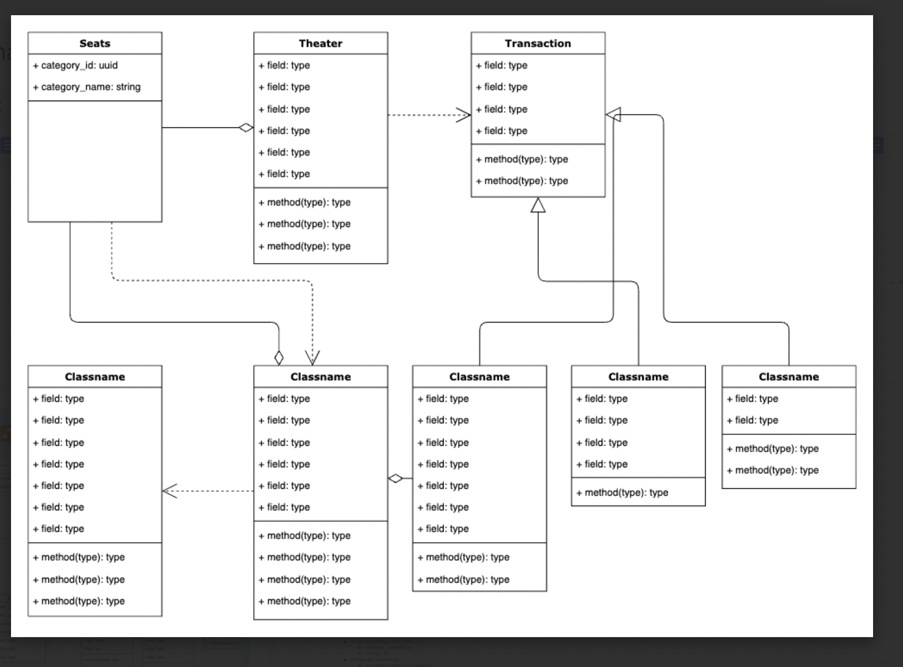

# SimpliTrac JTC Capstone

<br>

Simplicity in finance Tracking

Live - [https://dave-b-b.github.io/simplitrac_frontend](https://dave-b-b.github.io/simplitrac_frontend)

## Table of Contents:

**[Team](#team)**<br>
**[Tech Stack](#tech-stack)**<br>
**[Project Overview](#project-overview)**<br>
**[Project Planning and Organization](#project-planning-and-organization)**<br>
**[Backend API Endpoint](#backend-api-endpoint)**<br>
**[Development Server Setup](#development-server-setup)**<br>

## Team:

- Paul An - Product Owner / Scrum Leader
- Dave Brown - Technical Lead
- Patrick Snoop - UX, Testing, and QA Lead
- Edward Diaz - AI Tech lead
- Kirn Kim - Documentation and Presentation Lead

## Tech Stack:

- React
- Firebase
- Google OAuth
- Google Cloud Vision
- BigQuery
- Looker Studio

## Project Overview:

<ins>Problem</ins>: Finance tracking applications are often complicated, having an abundance of functionality which often goes unused. This leads to frustration for the end user, who may try the app, but soon stops using it after finding it difficult to use.

<ins>Objective</ins>: SimpliTrac is a simple, no-frills application that utilizes artificial intelligence to make finance tracking simpler.

## Project Planning and Organization:

The Entity Relationship Diagram for the data collection is as follows:

- User (collection)
    - user_id: str
    - google_id: str
    - email: str
    - first_name: str
    - last_name: str
    - created_at: datetime
    - last_login: datetime
    - admin: bool
    - Category (sub-collection) 
        - category_id: uuid
        - category_name: str
    - Transaction (sub-collection)
        - transaction_id: uuid
        - created_at: DateTime
        - transaction_date: date
        - amount: int
        - vendor: str
        - category_id: user.Category.category_id
        - is_successful: bool
        - recheck: bool

Swimlane Diagrams:<br>
<br>
<br>

## Backend API Endpoint

[https://firestore.googleapis.com/v1/projects/simplitracapp/databases/(default)/documents/Users/{user_id}]

## Development Server Setup:

1. Navigate to the folder where you want to close the repository. Make sure you are standing in the root folder and run the following command:

`git clone git@github.com:dave-b-b/SimpliTrac.git`

2. Make sure that you have Python installed on your machine. If you do not, then install Python3.12.

3. Install the [Firebase CLI](https://firebase.google.com/docs/cli#setup_update_cli). If you haven't signed up for a Firebase account, you should set that up too.

4. Install the dependencies for the client and the server:

`chmod 755 ./bin/install_dependencies.sh`

`./bin/install_dependencies.sh`

   This will install the following dependencies for the server:

   - Firebase Admin (Connects to Firestore)
   - Firestore (Database and "backend server")
   - Emulators (For testing Firestore locally)

   This will install the following dependencies for the client:

   - insert dependencies here

5. Once you have this set up, you'll need to get a key from Firebase. To do this, follow these steps:

    - Go to the Firebase console.
    - Click the gear near the top left of the screen and select "Project Settings".
    - Copy the "Web API Key"

6. Make sure that you put all secrets in your .env file. This file should be in the root of the server folder. The .env file should look like this:

```
SUPER_SECRET_KEY={your_secret_key_here}
```

## Running the Server for local testing 
Run the server for local testing:

    `firebase emulators:start`

## Deploying Code
To deploy the code, run the following command:

    `firebase deploy`

This will deploy everything at once. In my experience, you could really run into some problems by doing this, so its best to deploy each function individually by running this:

    `firebase deploy --only functions:<function_name>`

This will deploy the function with the name <function_name> to the cloud.

This avoids the issue where deploying everything my cause everything to break at once instead of just one function.

# Backend

## Introduction

Using Firebase Emulators allows you to simulate Firebase services locally, making it easier to develop and debug your application without affecting the live environment. This guide will walk you through setting up and using the Firebase Emulators to test and debug your endpoints effectively.

## Steps to Run Firebase Emulators

### 1. Start the Emulators

Open your terminal and navigate to your project directory. Start the Firebase Emulators by running the following command:

```bash
firebase emulators:start
```

This command will start the emulators for the services specified in your `firebase.json` configuration file.

### 2. Prepare Your Development Environment

To effectively debug your code, make sure you have the following tools open:

- **Web Browser**: Access the Firebase Emulator UI at `http://localhost:4000/logs` to monitor logs and view the database state.
- Access the database at `http://localhost:4000/firestore/default/data`
- **Visual Studio Code (VSCode)**: Use VSCode to write and debug your code.
- **Postman**: Use Postman to test your API endpoints and inspect the responses.

### 3. Create an Endpoint for Testing

Add the following code to define an HTTP function in your Firebase project. This function will serve as the endpoint for creating a new user:

```python
from firebase_functions import https_fn

@https_fn.on_request()
def test_controller(req: https_fn.Request) -> https_fn.Response:
    data = None

    try:
        data = req.get_json()
    except:
        pass
    print("Connected to endpoint")
    print("Here's the info you sent:", data)
    return https_fn.Response(f"Here's the data {data}")
```

### 4. Check the Logs

After starting the emulators and making a request to your endpoint, check the logs in your terminal or in the Firebase Emulator UI at `http://localhost:4000/logs`. Look for messages like "Connected to endpoint" to confirm that your request has reached the server.

### 5. Inspect the Response in Postman

Use Postman to send a request to your endpoint (e.g., `http://localhost:5001/simplitracapp/us-central1/test_controller)). Verify that you receive the expected response and that the data you sent is correctly processed.

### 6. Connect the Controller to the Service Layer

Update your controller function to interact with the service layer, which handles business logic. The service layer will process the request and pass data to the repository layer for database operations. Here’s an example service layer function:

```python
# backend/functions/controllers/test_controller.py
 # ADD THE SERVICE PACKAGE AT THE TOP
 
 from backend.functions.services.test_service.py import test_service
 
@https_fn.on_request()
def test_controller(req: https_fn.Request) -> https_fn.Response:
    data = None

    try:
        data = req.get_json()
    except:
        pass
    # print("Connected to endpoint")
    # print("Here's the info you sent:", data)
    result = test_service(data)
    return https_fn.Response(f"Here's teh result from the service layer {result}")

```

```python
# backend/functions/services/test_service.py

def test_service(data):
    
    return f"This is the data you sent{data}. It reached the service layer"
````

Test the integration to ensure the service layer correctly interacts with the controller.

### 7. Connect the Service Layer to the Repository Layer

Finally, integrate your service layer with the repository layer, which handles database interactions. Here's an example repository layer function:

```python
# backend/functions/services/test_service.py
# UPDATE YOUR SERVICE LAYER TO GO TO YOUR DATA LAYER
from backend.functions.repository.test_repo.py import test_repo

def test_service(data):
    result = test_repo(data)
    return result
```

```python
# backend/functions/services/test_repo.py

from backend.functions.models.user import User
def test_repo(data):
    user1 = User()
    result = user1.update_user_in_firestore()
    return f"This is the data you sent{data}. It reached the data layer. Here's a response from the database: {result}"
```

Test the complete flow to ensure that the entire stack—from the controller to the repository—works as expected.

## Summary

Using Firebase Emulators allows you to test and debug your Firebase functions locally. By following these steps, you can set up your development environment, create and test endpoints, and integrate your service and repository layers effectively.

Keep this guide handy for your development workflow, and don't hesitate to reach out if you need further assistance!

---

### Additional Resources

- [Firebase Emulator Suite Documentation](https://firebase.google.com/docs/emulator-suite)
- [Postman Download and Documentation](https://www.postman.com/downloads/)

---

